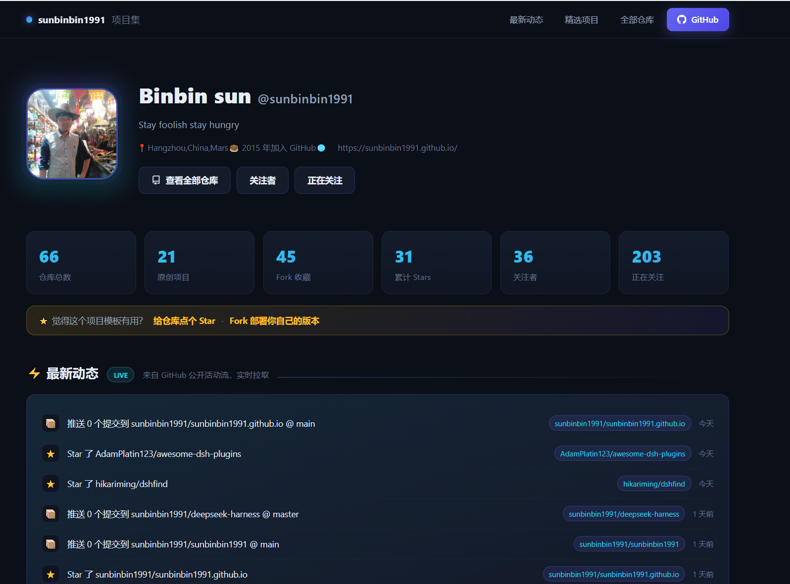

<div align="center">

# 🚀 GitHub Portfolio Auto-Site

**输入 GitHub 用户名 → 自动生成个人项目汇总页（GitHub Pages 一键部署 · 每 6 小时自动刷新 · API 限流自动回退）**

Generate a personal GitHub portfolio site from any username — auto-refreshing, zero-maintenance, free.

[](https://github.com/sunbinbin1991/sunbinbin1991.github.io/actions/workflows/refresh-data.yml)
[](LICENSE)
[](https://github.com/sunbinbin1991/sunbinbin1991.github.io)
[](https://github.com/sunbinbin1991/sunbinbin1991.github.io)

**Live demo:** https://sunbinbin1991.github.io/

</div>

---

<!-- 截图占位：把网站首页截图保存为 docs/screenshot.png 后，取消下面这行的注释即可显示 -->

doc
## ✨ Features

- **⚡ Live activity feed** — recent Star / Fork / Push / PR events pulled straight from the GitHub API
- **🗂 Full repo showcase** — language, stars, forks, topics, homepage, last-updated for every public repo
- **🔍 Powerful filters** — search, type (original / fork), language chips, 5 sort orders
- **⭐ Featured originals** — top projects ranked by stars, forks collapsed below
- **📱 Responsive dark UI** — zero build tools, zero dependencies, single HTML file

## 🧠 How it stays fresh (the interesting part)

| Layer | Mechanism |
| --- | --- |
| **Scheduled rebuild** | GitHub Actions runs `_data/build.py` every **6 hours**, re-fetches repos + activity and commits a fresh `data.js` snapshot |
| **Live pull** | On page load, the browser fetches latest data directly from `api.github.com` (10-min localStorage cache) |
| **Graceful fallback** | When the API is rate-limited (60 req/h per IP unauthenticated), the site silently falls back to the snapshot — visitors always see content |

No server, no database, no cost. Pages + Actions free tier is enough for a lifetime of auto-refresh.

## 🚀 Quick start (Fork & deploy in 2 minutes)

1. **Fork** this repository
2. In the fork, edit `_data/build.py`: change `LOGIN = "sunbinbin1991"` to **your** GitHub username
3. Run the `Refresh portfolio data` workflow once (**Actions** tab → left sidebar → *Refresh portfolio data* → **Run workflow**)
4. Go to **Settings → Pages**, deploy from `main` branch root → done 🎉

That's it. Your site is live at `https://<your-username>.github.io/`, and the scheduled workflow keeps it fresh automatically.

> 💡 Want to preview locally first? Just open `index.html` in a browser — it works from the file system, no server needed.

## 📁 Repo layout

```
index.html                    # the whole site (CSS + JS inline, zero deps)
data.js                       # data snapshot, auto-rebuilt by the workflow
.github/workflows/refresh-data.yml   # scheduled rebuild (every 6h, also manual)
_data/build.py                # fetcher: user + repos + events -> data.js
```

## 🛠 Customization

- **Colors / layout** — edit the CSS variables at the top of `index.html`
- **Refresh frequency** — change the `cron` in `.github/workflows/refresh-data.yml`
- **Featured count** — tweak `top_original[:6]` in `_data/build.py`
- **Bio / links** — edit your GitHub profile, the site picks them up automatically

## 🧰 Tech stack

GitHub Pages · GitHub Actions · GitHub REST API · Vanilla JavaScript · Python

## 📄 License

[MIT](LICENSE) © 2026 sunbinbin1991

---

## 中文说明

这是一个**开箱即用的 GitHub 项目汇总页模板**：把你的用户名写进 `_data/build.py`，Fork 并开启 GitHub Pages，两分钟就能得到一个会自动更新的个人项目主页。

- 每 6 小时自动重建数据快照（GitHub Actions 定时任务）
- 访客打开页面时实时拉取最新仓库与动态（10 分钟本地缓存）
- GitHub API 限流时自动回退到快照数据，页面永不空白

在线示例：https://sunbinbin1991.github.io/ ｜ 觉得有用的话，欢迎 ⭐ Star 支持！
